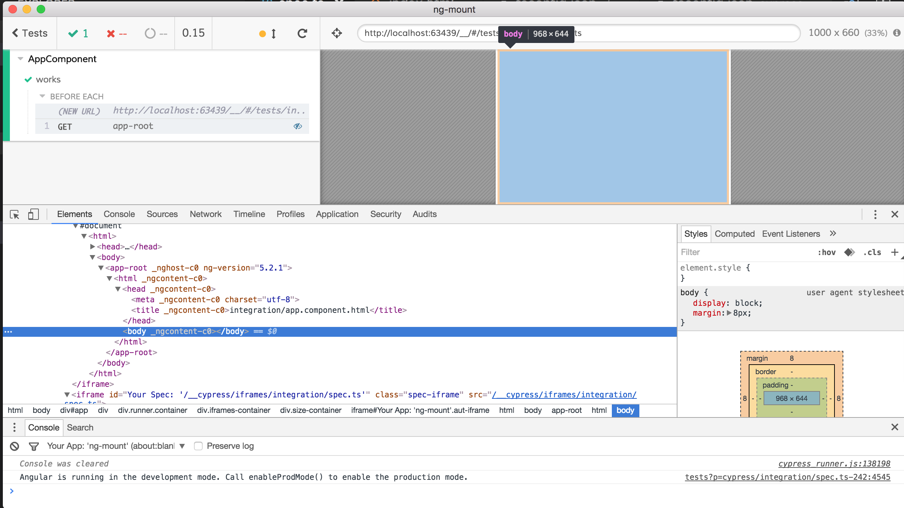

## BETA  [renovate-app badge][renovate-badge]][renovate-app]

If you run `$(npm bin)/cypress open` and click on "spec.ts" it does not show any errors, meaning a component has been bootstrapped. Not the HTML looks very weird and nothing is running. I assume the Angular code is running in the spec iframe and cannot cross into the app iframe where the component has been mounted.

See [cypress/integration/spec.ts](cypress/integration/spec.ts) for mounting code.

## Working

I have successfully used this mounting approach to test components in other frameworks.

* [cypress-vue-unit-test](https://github.com/bahmutov/cypress-vue-unit-test)
* [cypress-react-unit-test](https://github.com/bahmutov/cypress-react-unit-test)
* [cypress-cycle-unit-test](https://github.com/bahmutov/cypress-cycle-unit-test)
* [cypress-svelte-unit-test](https://github.com/bahmutov/cypress-svelte-unit-test)
* [cypress-angular-unit-test](https://github.com/bahmutov/cypress-angular-unit-test)
* [cypress-hyperapp-unit-test](https://github.com/bahmutov/cypress-hyperapp-unit-test)
* [cypress-angularjs-unit-test](https://github.com/bahmutov/cypress-angularjs-unit-test)

[renovate-badge]: https://img.shields.io/badge/renovate-app-blue.svg
[renovate-app]: https://renovateapp.com/
